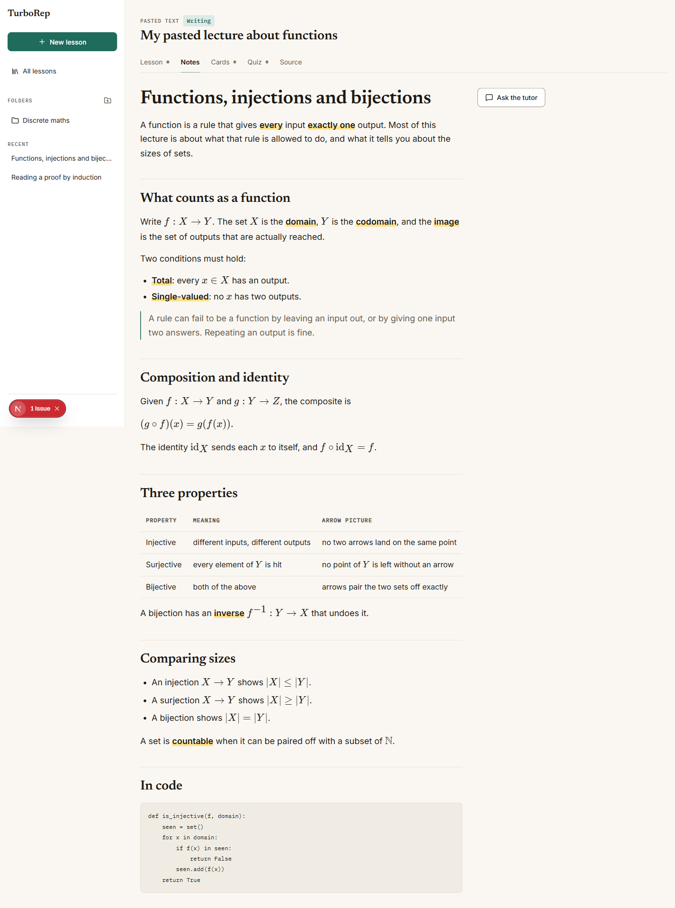

# Recall

Turn a lecture into something you can study from. Recall is a free, open-source study app that runs on your own computer: give it a PDF, some pasted text, a link or just a topic, and it produces notes, a guided lesson with questions, flashcards and quizzes, with a tutor chat that stays on that material.



## Status

This is an early build.

- **Working:** the full interface, and a local backend behind it. PDFs and pasted text are read on your machine, lessons are stored in a SQLite file, and notes, the guided lesson, flashcards, quizzes and chat replies are written by a model through your own ChatGPT plan.
- **Tested end to end:** sign-in, PDF upload, notes, the guided lesson, flashcards, a quiz and chat have all been run with a real ChatGPT account on a 23-page lecture. Notes start appearing in under ten seconds; a full set of notes takes a minute or two, as do the guided lesson and a quiz. Token refresh works. Scanned, password-protected and over-length PDFs are refused with a clear message. A source longer than about 120,000 characters is cut to its first part, and the notes say so.
- **Not built yet:** editing notes, export, link and video sources, a PDF viewer, and running a private copy on your own server.
- **No account needed to look around:** choose "Use the sample lessons" on the sign-in page to explore with built-in content.

## How your data is handled

- Everything is stored on your computer, in `~/.recall` by default.
- Sign-in tokens are encrypted at rest and never reach the browser.
- The app only answers requests from its own pages on `127.0.0.1`.
- The text of your material is sent to OpenAI to write lessons, and to nobody else.
- Signing in needs a ChatGPT Plus or Pro plan. Usage counts against that plan.

## Run it

Needs Node.js 22.13 or later (it uses the built-in SQLite module).

```bash
npm install
npm run dev
```

Then open http://127.0.0.1:4517 and either sign in with ChatGPT or use the sample lessons. The design system is at `/design`.

No configuration is required. Optional settings are listed in [.env.example](.env.example).

## How it is put together

- **Next.js (App Router) and TypeScript.**
- **Tailwind CSS 4** driven by design tokens. `docs/design/tokens.json` is the source; `npm run tokens` regenerates the CSS in `src/styles/`. Components use role names such as `bg-surface` and `text-muted`, never raw colours.
- **One data interface.** Screens only talk to `DataLayer` in `src/lib/data/types.ts`. It has two implementations: `api.ts`, which calls the local server, and `fake.ts`, the built-in sample lessons.
- **Server code in `src/server/`.** SQLite through Node's built-in module with SQL migrations in `migrations/`, sign-in in `auth.ts`, and every model call in `ai.ts` and `generate.ts`. Every query filters on the signed-in user, and model output is validated before it is stored.
- **Accessible primitives** in `src/components/ui/`, built on Radix where it helps. Text and UI colours meet WCAG AA in both themes.

More detail:

- [docs/architecture.md](docs/architecture.md): run modes, stack, API and build order
- [docs/schema.sql](docs/schema.sql): the planned database schema
- [docs/design/components.md](docs/design/components.md): component specs
- [docs/screenshots](docs/screenshots): every screen

## Keyboard

| Where | Keys |
| --- | --- |
| Lesson reader | Enter to continue, 1-4 to pick an answer |
| Quiz | 1-4 to pick, Enter to check |
| Flashcards | Space to turn the card, 1 still learning, 2 got it |

## Licence

MIT. See [LICENSE](LICENSE).

Recall is a personal, non-commercial project and is not affiliated with OpenAI.
